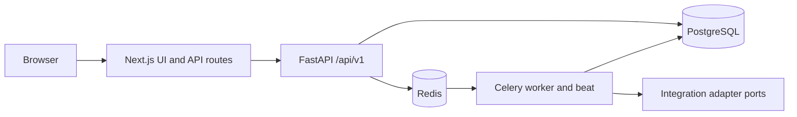

# CrewPilot OS

[](https://github.com/OmElMon/Forge/actions/workflows/ci.yml)

A field-service workspace for taking a customer from intake to a scheduled job and invoice. Built with Next.js, FastAPI, PostgreSQL, and Celery, CrewPilot OS brings CRM records, dispatch, billing, and operational follow-ups into one tenant-scoped product.

## What the implementation demonstrates

- Authenticated company workspaces with rotating refresh sessions, role checks, password reset, email verification, team invites, and MFA modules.
- Customer profiles, service addresses, equipment records, jobs, estimates, invoice line items, and explicit invoice lifecycle actions.
- Dispatch suggestions that rank technicians by required skills, availability, and overlapping jobs, returning reasons for each score.
- Analytics, audit logs, intake conversion, domain events, automation policies, and follow-up tasks.
- Alembic migrations and PostgreSQL row-level security, with API tests and frontend session tests in CI.

## Architecture



| Area | Implementation |
| --- | --- |
| Web | Next.js App Router, React, TypeScript, Tailwind CSS |
| API | Python 3.12+, FastAPI, Pydantic, SQLAlchemy 2, Alembic |
| Data and jobs | PostgreSQL 16, Redis 7, Celery |
| Deployment configuration | Docker Compose, Render backend, Netlify frontend |

## Run locally

Install Docker with Docker Compose, then:

```bash
git clone https://github.com/OmElMon/Forge.git
cd Forge
cp .env.example .env
# Edit .env and replace SECRET_KEY before starting.
docker compose up --build
```

In another terminal, apply migrations and optionally seed the local demo workspace:

```bash
docker compose exec api alembic upgrade head
make demo-seed
```

Open the [web app](http://localhost:3000) and [API documentation](http://localhost:8000/docs). Demo account details are defined in `apps/api/app/scripts/seed_demo.py`. Reseeding replaces that demo company's business records. The seed script has a production environment guard.

## Validation

```bash
make api-test
make api-lint
cd apps/web
pnpm install --frozen-lockfile
pnpm test
pnpm typecheck
pnpm build
```

CI also checks Python formatting, Alembic SQL generation, and a PostgreSQL-backed concurrency scenario. [CI run 35556626836](https://github.com/OmElMon/Forge/actions/runs/35556626836) completed successfully on September 21, 2026. These are recorded upstream results; this README update does not imply a new local test run.

The repository's [core workflow verification](docs/core-workflow-verification.md) records the customer → scheduled job → paid invoice flow, reload and login persistence, negative cases, and the exact environment tested.

## Scope and current limits

Dispatch recommendations use explicit scoring rules. Payment integrations currently register a disabled adapter; a hosted payment gateway should not be inferred from invoice status changes. The repository documents remaining provider setup and operational checks in [the handoff](docs/ai-handoff.md). Deployment configuration and local verification do not establish that a public production deployment or live provider integration is working.

## Explore the project

- [Architecture](docs/architecture.md)
- [Integration contracts](docs/integration-contracts.md)
- [Security](docs/security.md)
- [Deployment](docs/deployment.md)
- [Operations](docs/operations.md)
- [Roadmap](docs/roadmap.md)

No license file is currently included; no open-source license is asserted here.
