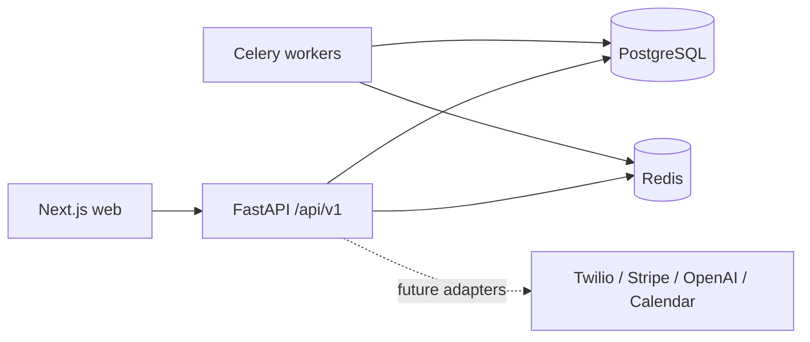

# Architecture

## Shape

CrewPilot OS is a modular monolith for the MVP. The web application and API deploy independently, while business modules share one PostgreSQL database and explicit service boundaries. This keeps delivery fast without collapsing the domain into an unstructured codebase. Modules can be extracted later when operational evidence justifies it.

## Tenant boundary

Every business-owned aggregate carries a non-null `company_id`. Request authentication resolves a user and active company membership before business services run. Repository/service queries must always include that company identifier. PostgreSQL row-level security is planned as defense in depth after the query boundary is established and tested.

Global tables are limited to platform identity and operational metadata. Tenant identifiers use UUIDs and are never accepted from untrusted request bodies when they can be derived from the authenticated principal.

## Modules

- Identity: users, companies, memberships, refresh sessions, RBAC
- CRM: customers, contacts, properties, equipment, conversations
- Field operations: jobs, appointments, technicians, dispatch
- Commerce: estimates, invoices, payments
- Platform: audit log, files, notifications, automations, integrations
- Intelligence: conversations, agent runs, tool calls, recommendations

AI capabilities consume domain services and emit audited domain events. They do not bypass authorization or write directly to business tables.

## API conventions

- Versioned under `/api/v1`
- UUID resource identifiers
- Pydantic request/response contracts
- Cursor pagination for high-volume event streams; offset pagination for administrative lists
- Idempotency keys for payment, communications, and automation commands
- Stable machine-readable error codes and correlation IDs
